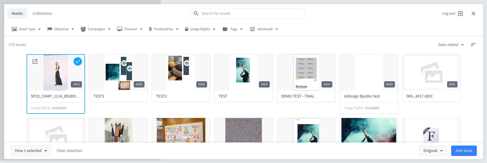
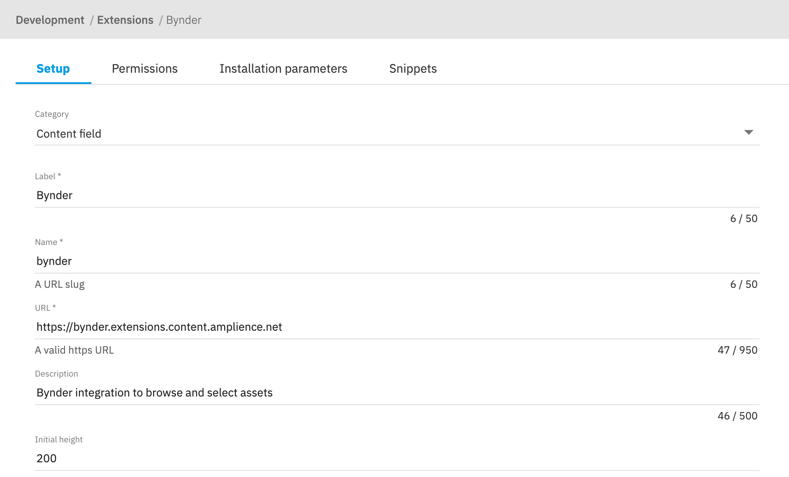
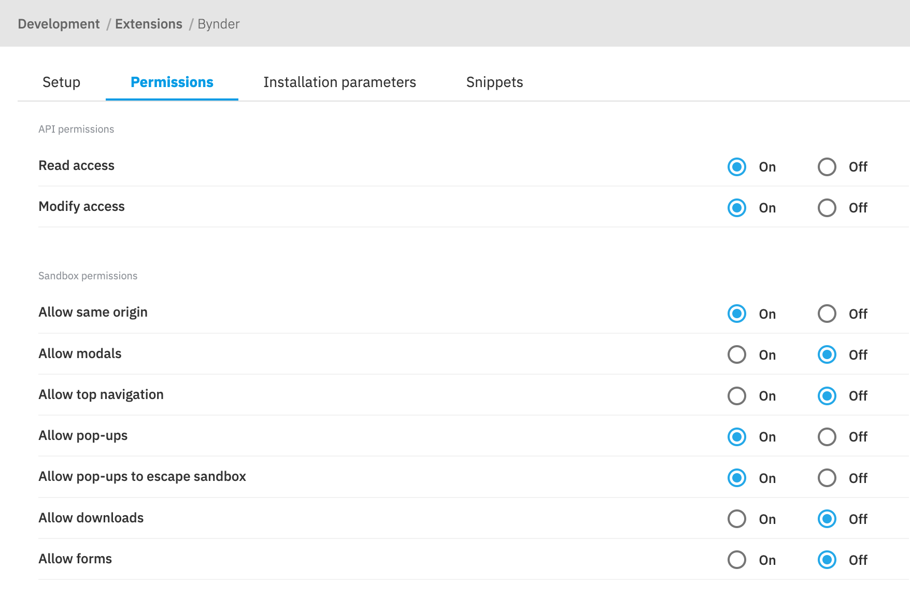

# dc-extension-bynder

This extension allows customers to browse and select files from Bynder / WebDAM directly in the Amplience Dynamic Content CMS.



## 🏁 Quickstart

### Register Extension
This extension needs to be [registered](https://amplience.com/docs/development/registeringextensions.html) against a Hub with in the Dynamic Content application (Developer -> Extensions), for it to load within that Hub.

TODO: Screenshot

- Category: Content Field
- Label: Bynder
- Name: bynder (needs to be unique with the Hub)
- URL: [https://bynder.extensions.content.amplience.net](https://bynder.extensions.content.amplience.net)
- Description: Rich text editor (can be left blank, if you wish)
- Initial height: 200

> Note: You can use our deployed version of this extension (builds from the "production" branch) -

[https://bynder.extensions.content.amplience.net](https://bynder.extensions.content.amplience.net)

As this is an open source project you're welcome to host your own "fork" of this project. You can use any standard static hosting service (Netlify, Amplify, Vercel, etc.) if you wish. Further information can be found on the [developing and building locally](./docs/developing+building-locally.md) and [support](./support.md) page.

#### URL options for Extension Setup
- Amplience hosted (if you are not self hosting which points to our 'production' branch): `https://bynder.extensions.content.amplience.net`
- Self hosted: This will be your main brand deployment URL
- Development: This will either be `http://localhost:3000` of your dev branch deployement url




### Extension Permissions Settings
Under the Permissions tab, select the following:



API Permissions:
- ✅ Read Access
- ✅ Modify Access
Sandbox Permissions:
- ✅ Allow Same Origin
- ✅ Allow Pop-ups
- ✅ Allow Pop-ups to escape sandbox

### Installation Parameters

Here is a sample installation parameters payload:

```json
{
  "bynderConfig": {
    "portal": {
      "url": "https://wave-trial.getbynder.com/"
    },
    "assetTypes": [
      "image"
    ],
    "mode": "MultiSelect"
  },
  "contentMapping": {
    "title": {
      "jsonPath": "$.name"
    },
    "mediaId": {
      "jsonPath": "$.databaseId"
    },
    "url": {
      "jsonPath": "$.url"
    }
  }
}
```

Elements in the `bynderConfig` object are passed to configure Bynder. The following asset types can be used:
- image
- document
- audio
- video

The mode can either be `SingleSelect` or `MultiSelect` if you want to choose more than one media.

It's also possible to use content mapping to get and rename the properties you need for the extension, using JSON Path.

### Schemas examples

You will find exmples in the following page: [Example Schemas](./docs/EXAMPLES.md)

## 🌍 Useful Links
-   [Automation](./docs/AUTOMATION.md)
-   [Contributing](./CONTRIBUTING.md)
-   [Support](./support.md)
-   [Licensing](./LICENSE)
