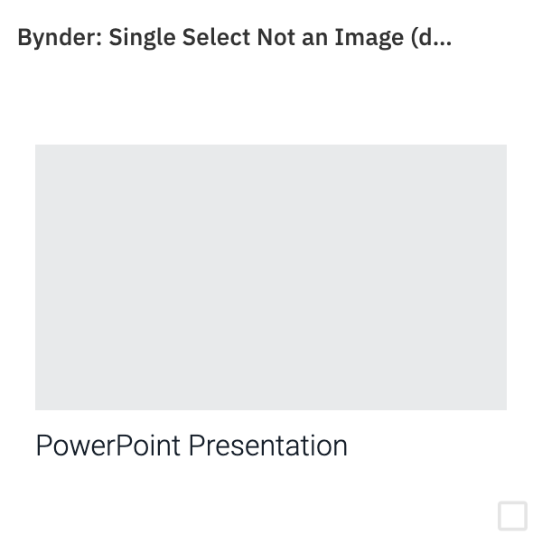

# Cards

These are iframed HTML pages which provide a preview of the content when selecting from the library view.

More information here: [Cards documentation](https://amplience.com/developers/docs/dev-tools/guides-tutorials/content-types/#configuring-a-card)

## General Reccomendation
We would recommend that cards are implemented as part of your application to give the most realisting preview possible. You are also welcome to use and customise the cards with details below mapping to your content.

## Sample Cards for Bynder Integration

There are 2 sample cards which can be used in your integration which align to the `mode`(s) in your extension configuration:

## Summary-photo Card

Mode Usage:
* Single Select (`SingleSelect`)
* Single Select File (`SingleSelectFile`)

Sample URL with default mappings (to use in Amplience):

```
https://amp-product.s3.eu-west-1.amazonaws.com/integration-examples/byndercards/summary-photo/index.html?headline=/bynder/name&image=/bynder/originalUrl&imageAlt=/bynder/name&src=%2F%2F{{vse.domain}}%2Fcms%2Fcontent%2Fquery%3FfullBodyObject%3Dtrue%26query%3D%257B%2522sys.iri%2522%253A%2522http%253A%252F%252Fcontent.cms.amplience.com%252F{{content.sys.id}}%2522%257D%26scope%3Dtree%26store%3Dstaging
 ```

 ### Customising the mapping

In the sample URL there are a number of parameters which can be customised:

|Parameter|Meaning|Default|Example re-mapping|
|:----|:----|:----|:----|
|headline|The text displayed in the card|`/bynder/name`|`/bynder/type`|
|image0|The first image to display if available|`/bynder/originalUrl`|`/bynder/files/thumbnail/url`|


### Examples
Below are examples of this card in use:

#### Single Select


* The image is mapped to the `originalUrl` attribute in the content saved in the Amplience Content Form. The view fills the maximum space at the right aspect ratio using the CSS attribute `object-fit: cover`
* The name is mapped to the `name` attribute in the content saved in the content form.

#### Single Select File


* The image is mapped to the `originalUrl` attribute in the content saved in the Amplience Content Form. The view fills the maximum space at the right aspect ratio using the CSS attribute `object-fit: cover`
* The name is mapped to the `name` attribute in the content saved in the content form.


## Gallery Card

Mode usage:
* Multi Select (`MultiSelect`)

Sample URL with default mappings (to use in Amplience):

```
 https://amp-product.s3.eu-west-1.amazonaws.com/integration-examples/byndercards/gallery/index.html?headline=/bynder/0/name&image0=/bynder/0/originalUrl&image1=/bynder/1/originalUrl&image2=/bynder/2/originalUrl&image3=/bynder/3/originalUrl&imageAlt0=/bynder/0/name&imageAlt1=/bynder/1/name&imageAlt2=/bynder/2/name&imageAlt3=/bynder/3/name&src=%2F%2F{{vse.domain}}%2Fcms%2Fcontent%2Fquery%3FfullBodyObject%3Dtrue%26query%3D%257B%2522sys.iri%2522%253A%2522http%253A%252F%252Fcontent.cms.amplience.com%252F{{content.sys.id}}%2522%257D%26scope%3Dtree%26store%3Dstaging
 ```

### Customising the mapping

In the sample URL there are a number of parameters which can be customised:

|Parameter|Meaning|Default|Example re-mapping|
|:----|:----|:----|:----|
|headline|The text displayed in the card|`/bynder/0/name`|`/bynder/0/type`|
|image0|The first image to display if available|`/bynder/0/originalUrl`|`/bynder/0/files/thumbnail/url`|
|image1|The second image to display if available|`/bynder/1/originalUrl`|`/bynder/1/files/thumbnail/url`|
|image2|The third image to display if available|`/bynder/2/originalUrl`|`/bynder/2/files/thumbnail/url`|
|image3|The fourth image to display if available|`/bynder/3/originalUrl`|`/bynder/3/files/thumbnail/url`|
|imageAlt0|Alt text for the first image if there is an error state|`/bynder/0/name`|`/bynder/0/id`|
|imageAlt1|Alt text for the second image if there is an error state|`/bynder/1/name`|`/bynder/1/type`|
|imageAlt2|Alt text for the third image if there is an error state|`/bynder/2/name`|`/bynder/2/type`|
|imageAlt3|Alt text for the fourth image if there is an error state|`/bynder/3/name`|`/bynder/3/type`|


### Examples
Below are visual examples of this card in use:

#### Multi Select (1 item)


* The image is mapped `originalUrl` attribute in the content saved in the Amplience Content Form for the **first** item. The view fills the maximum space at the right aspect ratio using the CSS attribute `object-fit: cover`
* The name is mapped to the `name` attribute in the content saved in the content form for the **first** item.

#### Multi Select (2 items)


* The images are mapped `originalUrl` attribute in the content saved in the Amplience Content Form for the **first and second** items. Each image takes 50% of the width available in the card. The view fills the maximum space at the right aspect ratio using the CSS attribute `object-fit: cover`
* The name is mapped to the `name` attribute in the content saved in the content form for the **first** item only.

### Multi Select (3 items)


* The images are mapped `originalUrl` attribute in the content saved in the Amplience Content Form for the **first, second and third** items. The first item is full width, the second and third items are 50% of the card width. The view fills the maximum space at the right aspect ratio using the CSS attribute `object-fit: cover`
* The name is mapped to the `name` attribute in the content saved in the content form for the **first** item only.

### Multi Select (4 items)


* The images are mapped `originalUrl` attribute in the content saved in the Amplience Content Form for the **first, second, third and forth** items. Each item is 50% width and height of the card. The view fills the maximum space at the right aspect ratio using the CSS attribute `object-fit: cover`
* The name is mapped to the `name` attribute in the content saved in the content form for the **first** item only.

## Customisation Reccomendations

### Image mappings
These examples and automation use a mapping for the `originalUrl` attribute as this is the only known data source.

Whilst functional, they have the following issues which you may wish to optimise based on your setup:

1) **File Size:** the `originalUrl` attribute is the full size of the asset. This means cards can be very large to load. If you have derivitates and other files in Bynder more suitable for this view (like a thumbnail) we would recommend mapping to these as per the examples.

2) **File Format:** the `originalUrl` attribute is the source file. Bynder can store other file formats which are not images (like documents, videos, audio etc.). In Bynder you may have derivates and files which are more suitable to use as an image.

#### What happens with a 'non-image' file format?

For Single Select, if the URL is not an image, then a placeholder grey box will display:



For Multi Select, if URLs are not images, they will either 404 or display a placeholder grey box:


## Automation Examples
Please refer to our [Automation documentation](AUTOMATION.md)