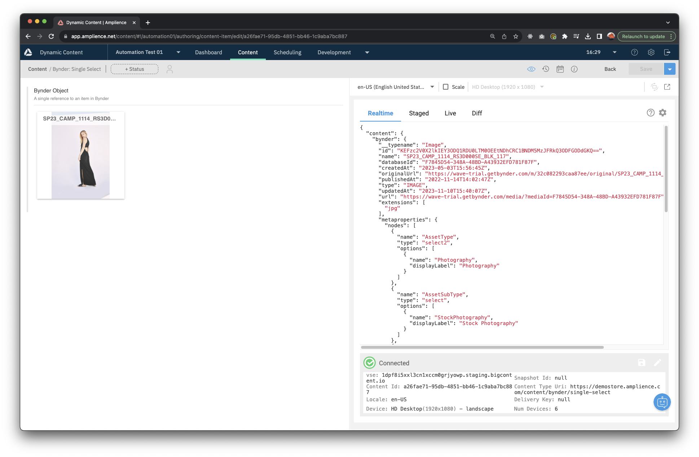

# Examples

This section presents examples which may be valuable in testing / implementation.

## Example schemas

Below you will find a list of example content schemas aligning to the different modes.

> Note: The extension name is different in each one for illustration purposes. Your extension name may just be `bynder` or any unique name you choose.

### Single Select schema

```json
{
  "$schema": "http://json-schema.org/draft-07/schema#",
  "$id": "https://demostore.amplience.com/content/bynder/single-select",
  "title": "Bynder Single Select",
  "description": "Example Schema for single select items from Bynder",
  "allOf": [
    {
      "$ref": "http://bigcontent.io/cms/schema/v1/core#/definitions/content"
    }
  ],
  "type": "object",
  "properties": {
    "bynder": {
      "title": "Bynder Object",
      "description": "A single reference to an item in Bynder",
      "type": "object",
      "properties": {},
      "ui:extension": {
        "name": "bynder-single"
      }
    }
  },
  "propertyOrder": []
}
```

Resulting content item:



### Single Select File schema

```json
{
  "$schema": "http://json-schema.org/draft-07/schema#",
  "$id": "https://demostore.amplience.com/content/bynder/single-select-file",
  "title": "Bynder Single Select File",
  "description": "Example Schema for single select items from Bynder with file selection",
  "allOf": [
    {
      "$ref": "http://bigcontent.io/cms/schema/v1/core#/definitions/content"
    }
  ],
  "type": "object",
  "properties": {
    "bynder": {
      "title": "Bynder Object File Selection",
      "description": "A single reference to an item in Bynder with file selection",
      "type": "object",
      "properties": {},
      "ui:extension": {
        "name": "bynder-single-file"
      }
    }
  },
  "propertyOrder": []
}
```

Resulting content item:


When a specific file is selected the saved JSON response will have an additional attribute `additionalInfo`. This can be used for the specific file that the user selected in your application.

Example:
```json
"additionalInfo": {
  "selectedFile": {
    "url": "https://wave-trial.getbynder.com/m/c123456789b83af/original/pencils.JPG",
    "width": 3024,
    "height": 4032,
    "fileSize": 1755462
  }
}
```

### Multi Select

```json
{
  "$schema": "http://json-schema.org/draft-07/schema#",
  "$id": "https://demostore.amplience.com/content/bynder/multi-select",
  "title": "Bynder Multi Select",
  "description": "Example Schema for multi select items from Bynder",
  "allOf": [
    {
      "$ref": "http://bigcontent.io/cms/schema/v1/core#/definitions/content"
    }
  ],
  "type": "object",
  "properties": {
    "bynder": {
      "title": "Bynder Array",
      "description": "A list of references to items in Bynder",
      "type": "array",
      "items": {},
      "ui:extension": {
        "name": "bynder-multi",
        "params": {}
      }
    }
  },
  "propertyOrder": []
}
```

Resulting content item:


## Example rendering

Examples of fetching stored Bynder data and rendering in an app.

Install and configure [dc-delivery-sdk-js](https://github.com/amplience/dc-delivery-sdk-js) as defined by the SDK's documentation.

Fetch your Bynder content item:

```javascript
const client = new ContentClient({
  hubName: "myhub",
});
const content = await client.getContentItemByKey("my-bynder-image-key");
const bynderImage = content.body;
```

Render your data - Javascript:

```javascript
const container = document.getElementById("image-container");

container.innerHtml = ``;
```

Render your data - React:

```javascript
import React from "react";

function BynderImage({ bynderImage }) {
  return ;
}

export default BynderImage;
```
