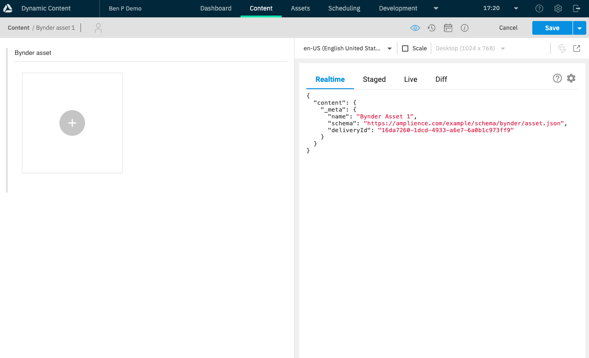
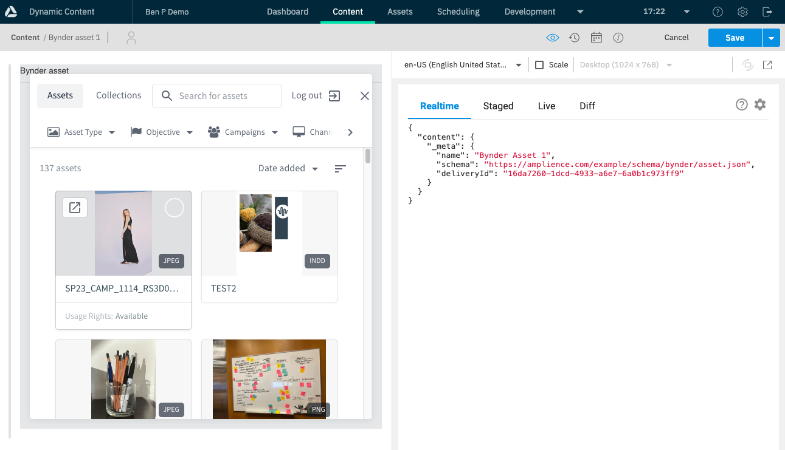
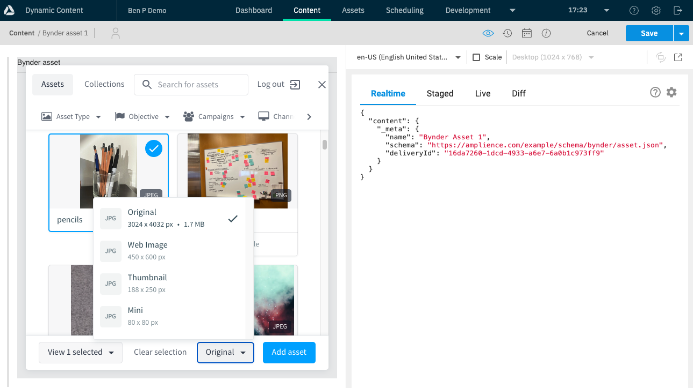
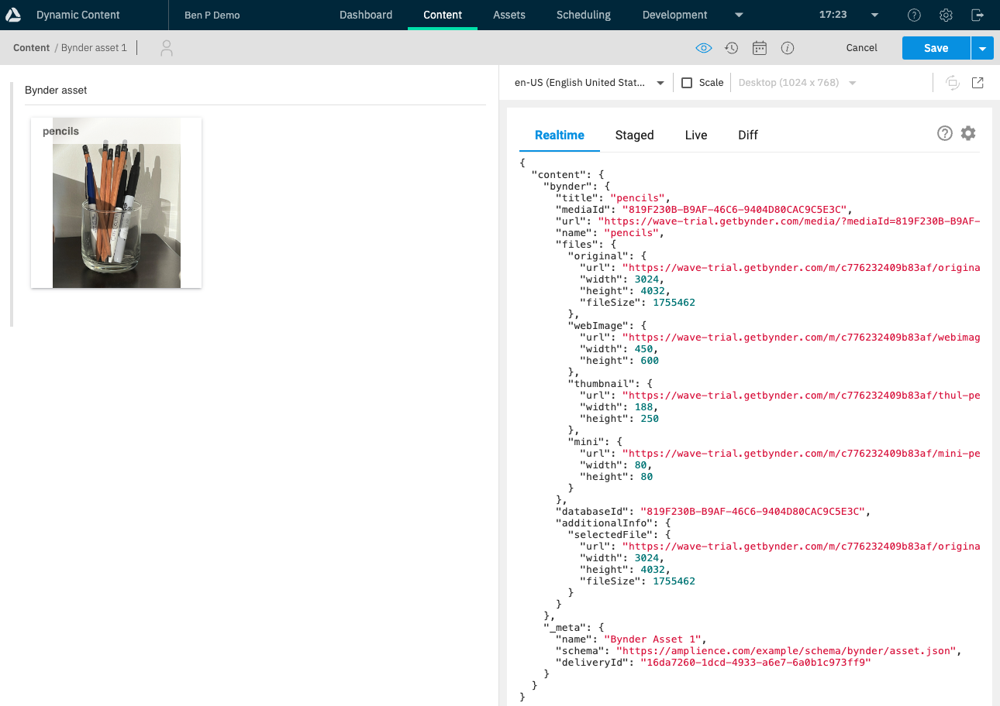
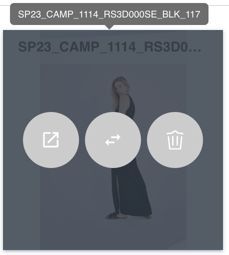
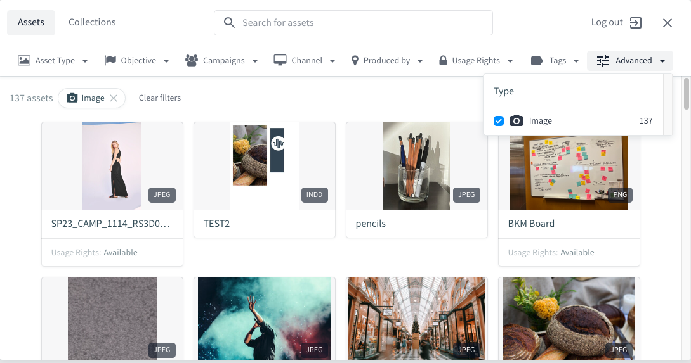
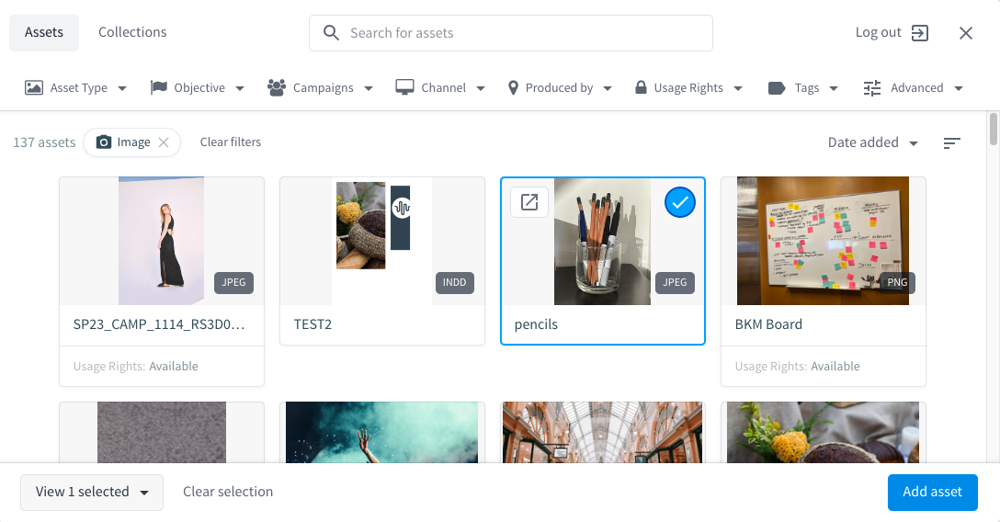
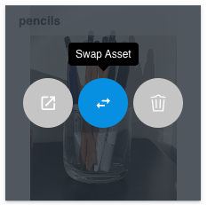

# Usage

## Prerequisites

In order to use this integration you must have the following:

- An Amplience account with access to the Dynamic Content Platform.
  - This requires Developer permissions role (or higher) to install and use the extension in schemas/content types
- A Bynder (WebDAM) account setup with any Bynder pre-requisites to use Universal Compact View

## Table of Contents

- [Using the extension](#using-the-extension)
- [Usage flow](#usage-flow)

## Using the extension

This document provides details of how to use the integration between Amplience’s CMS (Dynamic Content) and Bynder (WebDAM).

Alternatively, return to [README.md](../README.md) for more information on the extension.

### Usage flow

Below are illustrative examples of how this extension will function for the end user.

Figure 1: Shows that the extension will be a field extension in Amplience (Green box). You can have other standard fields in the content type in conjunction with this extension providing they are outside of the field that the extension overwrites the UI for.

Figure 2: Illustrates that users will be able to click to add an asset from Bynder. The UI will be similar to the UI for adding items from Amplience.

Figure 3: Illustrates that when the user chooses to select an asset from Bynder the Universal Compact View will be launched in the extension allowing to browse and select the asset.

Figure 4: Illustrates that when the user has selected an asset from Bynder, a card will be displayed with the selected asset information which are:

- Name
- Image from Bynder

This illustration also shows that the data from Bynder is stored in the Amplience content form and available for front end renders (including Live, Preview and visualisation)

Figure 5: Is an illustrative example of a card. The UI may change during development but it has the following capabilities:

- Name (with hover tooltip to display the full name if large)
- Image (if there is an image reference from Bynder it will be displayed)
- Action buttons (all have tooltips)
  - View in Bynder: Launches directly to the back office in Bynder to view / edit the asset
  - Swap: Enables the user to swap this asset with another asset from Bynder. This launches the Bynder Universal Compact view with the current selected asset. When selecting a new asset the old reference will be overwritten
  - Remove asset: Deletes the asset from the Amplience content

## Use cases

### Single select

The example we will use here, is adding a video from Bynder into Amplience using the Bynder extension.

Go to the Content tab and Create Content.

Search for the content type or scroll and select.

Click the + icon to add an asset. This opens the Bynder extension.

Depending how you have configured your extension, you will see a toolbar across the top and the available asset card below.

#### Toolbar links

1. Asset Types lets you select the category of asset you would like to choose from.

2. Objective, Campaigns and Channel offers filtering on the purpose of the asset.

3. Produced By is a filter by regional markets.

4. Usage Rights – filter by the rights associated with each asset type.

5. Tags filter by tags assigned to the assets.

6. Advanced is very similar to Asset Type and it’s here we’ll filter the assets. I’ve chosen "Image" and we can see there are a number of assets that match that criterion.

The image shows the file type associated to that asset eg JPEG, PNG etc

To view the asset in a separate tab, click the "Popout" icon.

To add the asset click the checkbox then Add asset.

Back in Amplience, if you are happy with your asset, click Save. This will prompt you to give the content item a name.

Click Back to return to the list of Content Items and your new item will be at the top of the list.

If you wish to amend the Assets within the Content Item, re-open it and for each Asset you will see three icons. Open in pop-out (Bynder), Swap and Delete. To Swap an asset, click the icon and choose the Asset you wish to replace it with.

### Multi select

Works in very much the same way as Single Select the only difference being you can select more than one Asset per Content Item.

The minimum and maximum number of Assets that can be added to the Content Item are defined in the corresponding Content Type Schema.
