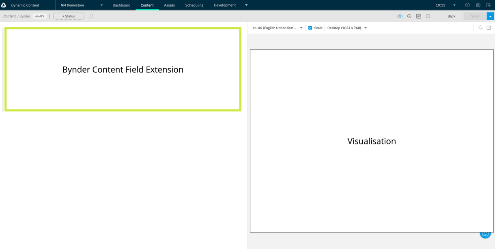
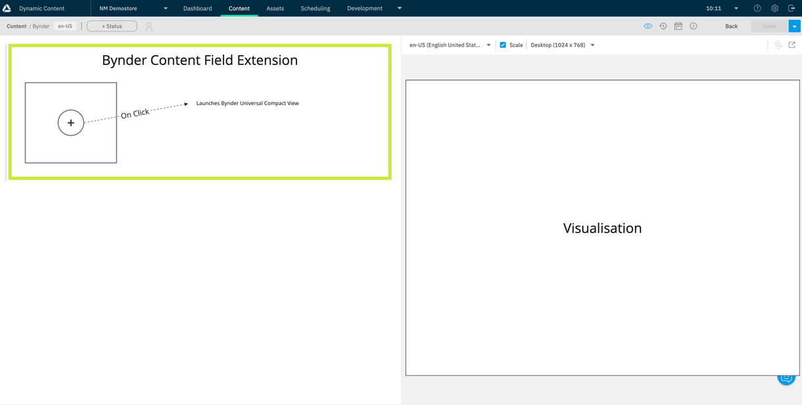
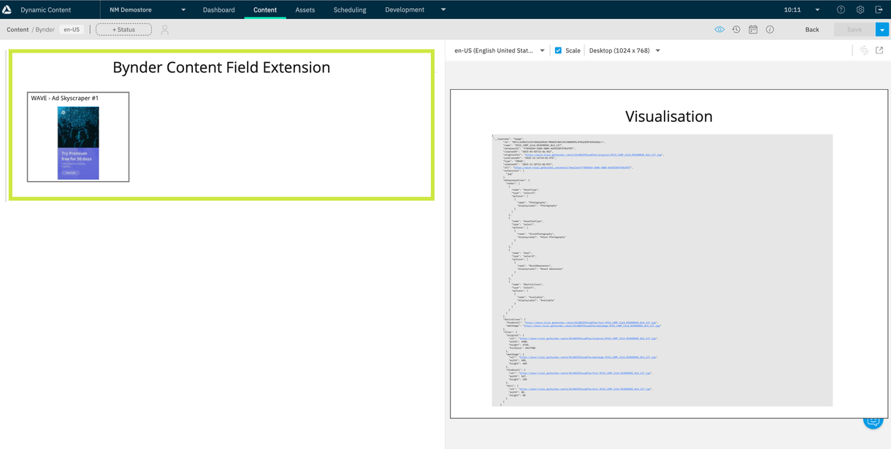
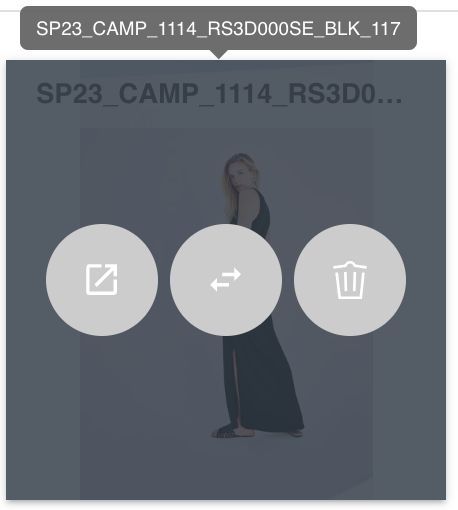

# dc-extension-bynder

## Table of Contents

- [Using the extension](#using-the-extension)
- [Usage flow](#usage-flow)

## Using the extension

This document provides details of how to use the integration between Amplience’s CMS (Dynamic Content) and Bynder (WebDAM).

Alternatively, return to [README.md](../README.md) for more information on the extension.

### Usage flow
Below are illustrative examples of how this extension will function for the end user. 

Figure 1: Shows that the extension will be a field extension in Amplience (Green box). You can have other standard fields in the content type in conjunction with this extension providing they are outside of the field that the extension overwrites the UI for.

Figure 2: Illustrates that users will be able to click to add an asset from Bynder. The UI will be similar to the UI for adding items from Amplience.

Figure 3: Illustrates that when the user chooses to select an asset from Bynder the Universal Compact View will be launched in the extension allowing to browse and select the asset.

Figure 4: Illustrates that when the user has selected an asset from Bynder, a card will be displayed with the selected asset information which is:

Name

Image from Bynder

This illustration also shows that the data from Bynder is stored in the Amplience content form and available for front end renders (Including Live, Preview and visualisation)

Figure 5: Is an illustrative example of a card. The UI may change during development but it has the following capabilities:

Name (with hover tooltip to display the full name if large)

Image (if there is an image reference from Bynder it will be displayed)

Action buttons (all have tooltips)

View in Bynder: Launches directly to the back office in Bynder to view / edit the asset

Swap: Enables the user to swap this asset with another asset from Bynder. This launches the Bynder Universal Compact view with the current selected asset. When selecting a new asset the old reference will be overwritten

Delete: Removes the asset from the Amplience content

TODO:
--Finish usage text
